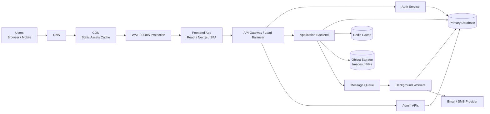
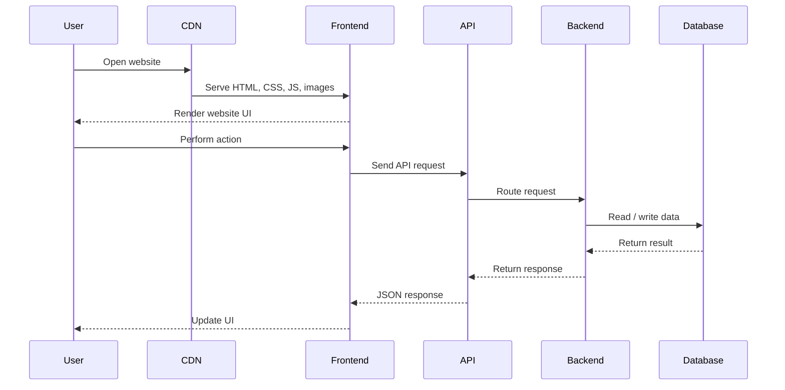
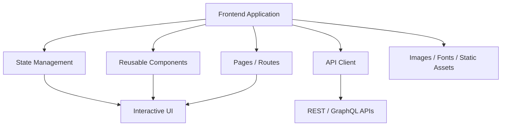
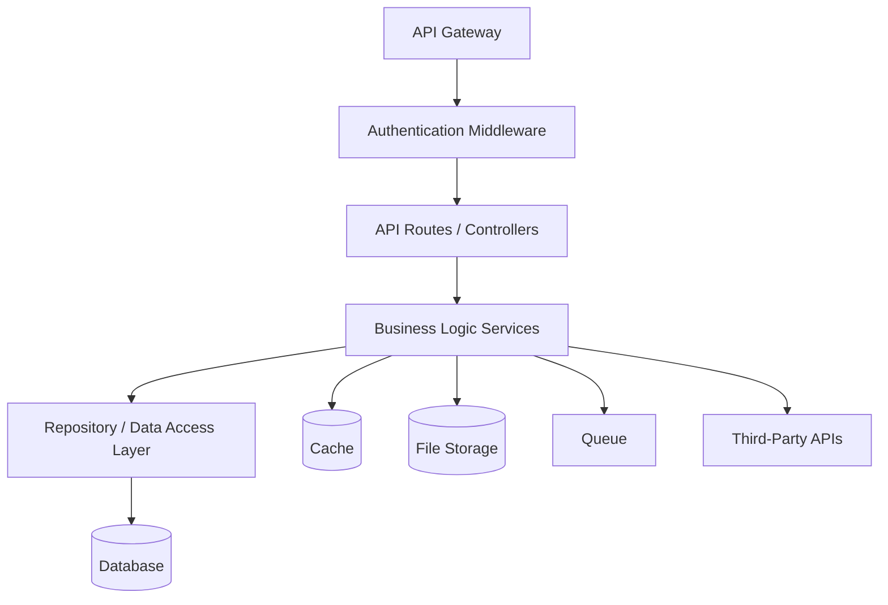
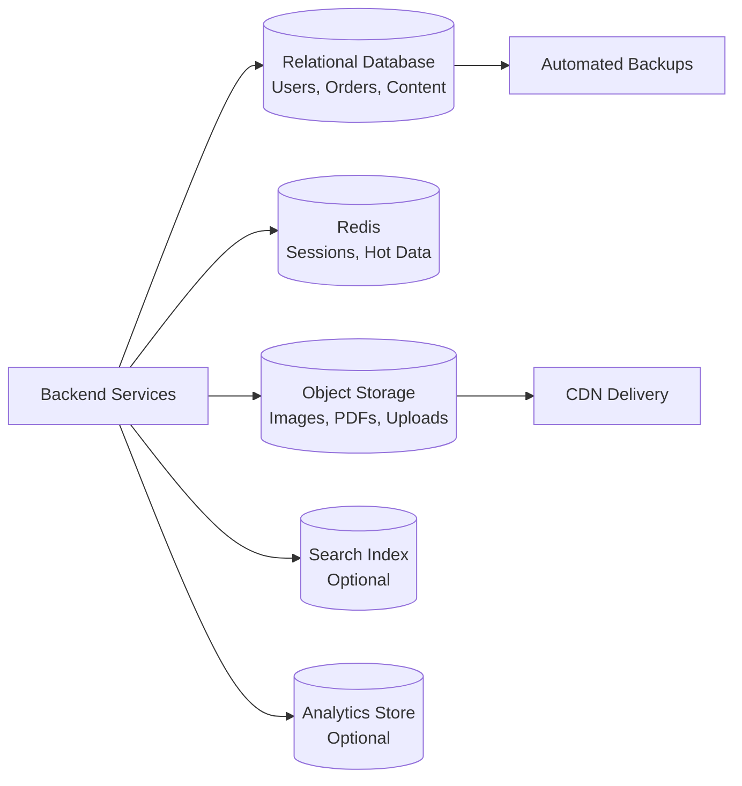
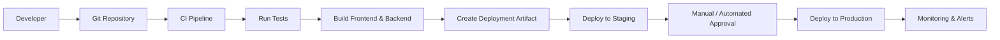
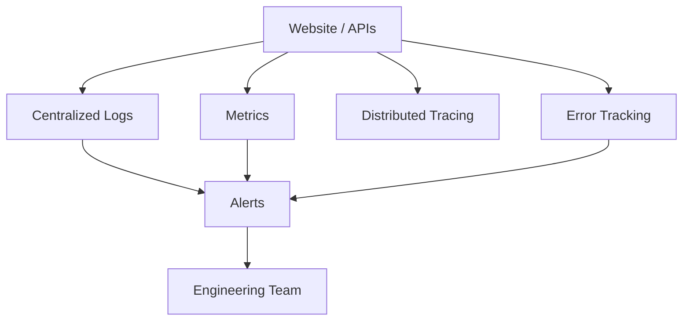
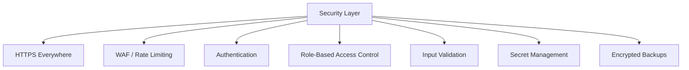

# Website Architecture Idea

This document explains a complete high-level architecture for a production-ready website. It covers how users reach the website, how frontend and backend systems communicate, how data is stored, and how the application is deployed and monitored.

## 1. High-Level Architecture



## 2. Request Flow



## 3. Frontend Layer



The frontend is responsible for user experience, page routing, forms, validations, API calls, and rendering server data in a clean interface.

## 4. Backend Layer



The backend handles authentication, authorization, business rules, database operations, file uploads, notifications, payments, and integration with external services.

## 5. Data Architecture



Recommended data responsibilities:

- Database: permanent business data.
- Cache: fast repeated reads and session data.
- Object storage: user-uploaded files and media.
- Search index: fast product, content, or document search.
- Backups: recovery from accidental deletion or system failure.

## 6. Deployment Pipeline



The deployment pipeline should test every change before release, build predictable artifacts, deploy first to staging, and then promote stable builds to production.

## 7. Monitoring and Operations



Important production signals:

- API latency and error rate.
- Frontend load time and JavaScript errors.
- Database CPU, memory, slow queries, and storage.
- Queue backlog and worker failures.
- Uptime, SSL expiry, and CDN errors.

## 8. Security Checklist



Core security practices:

- Use HTTPS for all traffic.
- Store passwords with strong hashing.
- Keep secrets out of source code.
- Validate all user input on the backend.
- Apply role-based access for admin features.
- Rate-limit login and sensitive APIs.
- Keep database backups encrypted.

## 9. Suggested Folder Structure

```text
project-root/
  frontend/
    src/
      components/
      pages/
      services/
      styles/
  backend/
    src/
      controllers/
      services/
      repositories/
      middleware/
      config/
  Idea/
    README.md
```

This structure keeps frontend, backend, and planning documentation separated while making the architecture easy to understand for future development.
